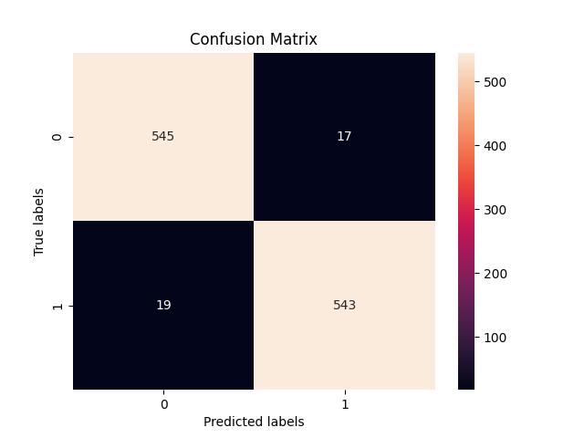
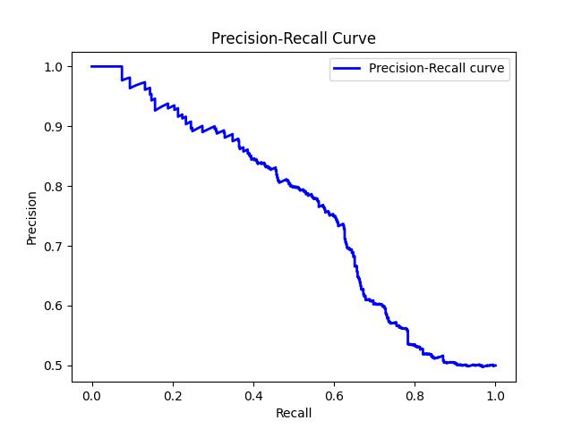
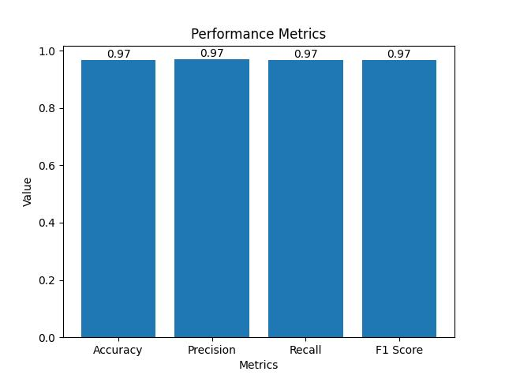

# Gender-Detection


In this repository, you can find a human gender detection implementation. The overall system consists of two main parts: 

1. Face Detection
2. Gender Detection

First, all the human faces are found in the provided image using the pretrained **YOLOv8n-face** model which can be found in the [models](https://github.com/anilcanbulut/Gender-Detection/tree/master/models) folder. Each detected face is cropped, resized and then fed to another classification network to find out the gender. To train the network, [Gender Recognition Dataset](https://www.kaggle.com/datasets/rashikrahmanpritom/gender-recognition-dataset/data) from Kaggle is used. However, the dataset was not ready to model training because there were several problems. Subsets contain doubled images (especially the validation set). There were images that did not belong to the subset's gender folder e.g. a male image inside female folder. There were images that contain multiple faces or no visible faces at all. This repository also provides scripts to filter out those images. After these, the dataset contained approximately 10k images. 

Several classification models are used during the project experiments: Resnet18, Resnet34, Resnet50, EfficientNet_b0, EfficientNet_b1. It was seen that the **EfficientNet_b1** model provided better results both in the test dataset and in real-life images. Some figures related to performance evaluation of the EffientNet_b1 model can be seen below


|  |  |  |
| :---------------------------------------------------------: | :---------------------------------------------------------: | :---------------------------------------------------------: |
| Confusion Martix Result                                   | Precision and Recall Curve                                | Accuracy, Precision, Recall, and F1-Score                 | 

**Note:** The same results can be obtained using the repository codes. Also, the repository currently only supports EfficientNet architectures. If you want to use Resnet models, you should change the part in the codes where the last layer in the classifier part is defined.

## Model Weights

| Model                                                                                                 |
| ----------------------------------------------------------------------------------------------------- |
| [EfficientNet-b0](https://drive.google.com/file/d/1iShi0RrIAQGCDYlcJGdMG94alSl-Hhdq/view?usp=sharing) |
| [EfficientNet-b1](https://drive.google.com/file/d/1K7eJ87qAaSZEaINyA5C3LNDFsvsJ2pSn/view?usp=sharing) |
| [Resnet18](https://drive.google.com/file/d/17thzwBYPb4uLbW9tVaFJHr8qfkOU9X38/view?usp=sharing)        |
| [Resnet34](https://drive.google.com/file/d/188XZyF8HIfCIPmTsZblynT92j78rQE1Y/view?usp=sharing)        |
| [Resnet50](https://drive.google.com/file/d/1eVmNTE58baaUJQY_U0F0kSID6idbKd4Q/view?usp=sharing)                                                                                                      |

# Setup

First, create a Python virtual environment
```bash
python3 -m venv venv
source venv/bin/activate
```

Install the required libraries
```bash
pip install -r requirements.txt
```

# Test
Everything is handled inside the configuration file in the [configs](https://github.com/anilcanbulut/Gender-Detection/tree/master/configs) folder. Change the parameters under the "General" tab in the yaml file. Do not forget to change mode to "test". After this, if you provide a pretrained model, thatmodel will be used, if it is not provided, then the efficientnet-b1 model is going to be used.
```bash
python main.py
```
Once the testing is finished, model's performance evaluation plots are going to be stored in the "exps" folder.

# Train
First download the dataset from this [link](https://drive.google.com/file/d/1UaSOojfcxN--A3GyeHz8gR4hfjZa1SWD/view?usp=drive_link). It will already contain train, valid, and test folders. You can directly start a training with the default model.
```bash
python main.py
```